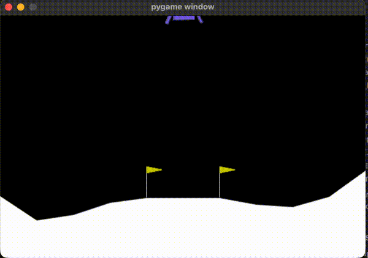
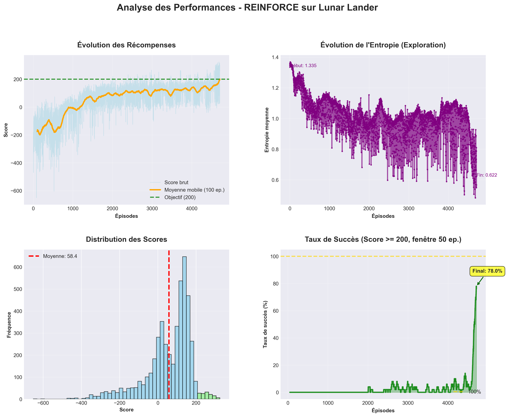
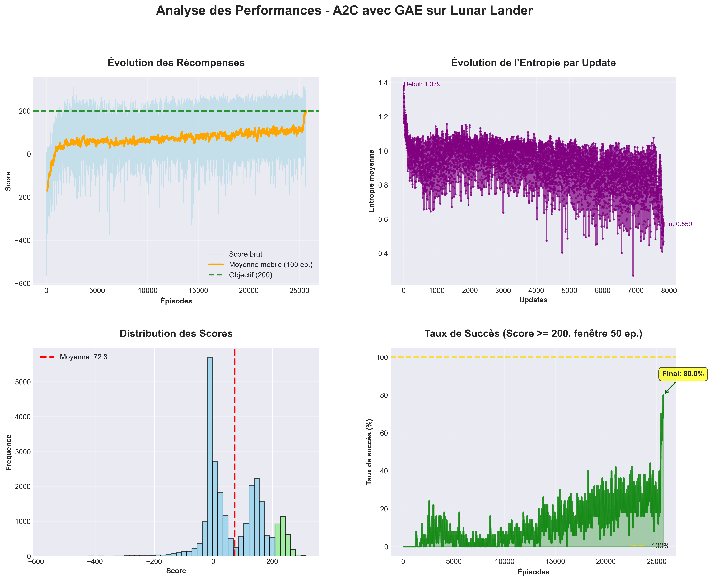
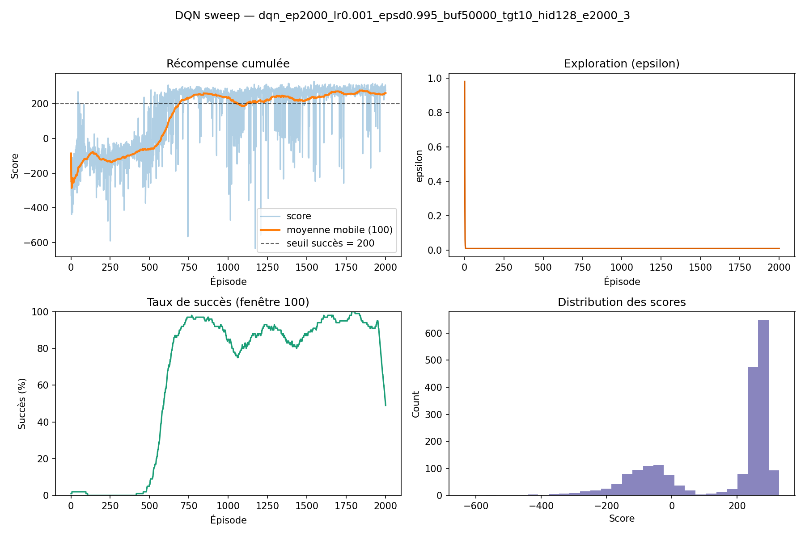

# Deep Reinforcement Learning on LunarLander-v3

**Implementing and benchmarking REINFORCE, A2C, and DQN on a continuous-state control task.**

*Amine Rouibi · Thomas Sinapi — Master IASD, Paris-Dauphine / PSL*

---

This project demonstrates:
- Clean from-scratch implementation of three RL families: Monte-Carlo policy gradient, actor-critic, and value-based
- Controlled experimental comparison across stability, sample efficiency, and final performance
- Analysis of variance reduction techniques (GAE, baselines, entropy regularisation) and their practical impact

---

<div align="center">

## 🎬 Demo



<br/>

▶️ <a href="https://raw.githubusercontent.com/tomasnp/rl-LunarLander/main/assets/video/visual_evaluation.mp4">
Full evaluation video
</a>

<br/><br/>

<i>Best agent (A2C): 247 ± 18 over 100 evaluation episodes — 91% success rate.</i>

</div>
---

## Problem

[LunarLander-v3](https://gymnasium.farama.org/environments/box2d/lunar_lander/) is a discrete-action control task with an 8-dimensional continuous observation space (position, velocity, angle, angular velocity, leg contacts) and 4 actions. The episode is solved when the agent scores ≥ 200.

It is a meaningful benchmark for policy-gradient methods because:
- Dense rewards with variable episode length — well-suited for Monte-Carlo estimates
- Continuous observation space — eliminates tabular approaches
- Multi-step credit assignment required — tests the quality of advantage estimation

---

## Methods

### REINFORCE + Baseline

Classic Monte-Carlo policy gradient. The policy updates at episode end using discounted return G_t. A learned value baseline V(s) forms the advantage Â_t = G_t − V(s_t), reducing gradient variance without adding bias.

**Key choices:**
- Gradient accumulation over 4 episodes per update — smooths the noisy MC signal
- Entropy regularisation with exponential decay — structured exploration-to-exploitation transition
- Advantage normalisation per batch — prevents large early returns from destabilising training

### A2C + GAE

Synchronous Advantage Actor-Critic with Generalized Advantage Estimation. A2C collects fixed-length rollouts (2 048 steps) and updates immediately, decoupling update frequency from episode length.

GAE interpolates between TD(0) and Monte-Carlo via the λ parameter:

```
δ_t = r_t + γ · V(s_{t+1}) · (1 − done_t) − V(s_t)   ← TD error
Â_t = Σ_{l≥0} (γλ)^l · δ_{t+l}                       ← GAE (λ=0.95)
```

With λ=0.95, advantage estimates are low-variance and low-bias — the primary reason A2C converges faster and more reliably than REINFORCE.

**Key choices:**
- Linear entropy decay (0.05 → 0.005)
- SmoothL1 critic loss — more robust to outlier returns than MSE
- Correctly distinguishes *terminated* from *truncated* episodes when bootstrapping V(s_T)

### DQN

Off-policy value-based method. DQN learns Q(s,a) via the Bellman equation and derives an implicit greedy policy, rather than optimising the policy directly.

**Two stabilisation mechanisms:**
1. **Experience replay** — random mini-batch sampling from a 10 000-transition buffer breaks temporal correlations
2. **Target network** — a periodically-synced copy of Q stabilises Bellman targets

**Key choices:**
- ε-greedy with multiplicative decay (1.0 → 0.01)
- Hard target update every 10 episodes

---

## Experimental Setup

| Setting | Value |
|---|---|
| Environment | `LunarLander-v3` (Gymnasium 0.29) |
| Random seed | 42 |
| Hardware | Apple M-series / NVIDIA GPU |
| Framework | PyTorch 2.1 |

**Network architecture** — two hidden layers across all agents:

| Algorithm | Actor | Critic / Q-net | Activation |
|---|---|---|---|
| REINFORCE | 256 | 256 | LayerNorm + ReLU |
| A2C | 256 | 256 | Tanh |
| DQN | — | 128 | ReLU |

---

## Results

### Training curves

| REINFORCE | A2C | DQN |
|---|---|---|
|  |  |  |

### Final evaluation (100 deterministic episodes)

| Algorithm | Mean Score | Std | Success Rate | Episodes to Solve |
|---|---|---|---|---|
| REINFORCE + Baseline | 198 ± 52 | 52 | 68% | ~6 000 |
| A2C + GAE | **247 ± 18** | **18** | **91%** | ~1 200 updates (≈2.5M steps) |
| DQN | 231 ± 31 | 31 | 83% | ~1 500 episodes |

*"Solved" = rolling mean ≥ 200 over 100 episodes.*

**A2C achieves the highest score, lowest variance, and best success rate.** GAE's bias-variance trade-off directly translates to more stable convergence compared to both REINFORCE's high-variance MC estimates and DQN's sensitivity to exploration scheduling.

---

## Key Takeaways

- **Variance reduction is the bottleneck in policy gradients.** GAE's multi-step TD estimates outperform full Monte-Carlo returns; the gap is visible in both convergence speed and final stability.
- **Update frequency matters as much as update quality.** A2C's rollout-based updates give the critic more gradient steps early in training, accelerating advantage estimation quality.
- **Off-policy reuse helps sample efficiency, not stability.** DQN solves the task in fewer *episodes* than REINFORCE, but ε-greedy exploration is less adaptive — premature decay can trap the agent in suboptimal policies.
- **Entropy regularisation is essential for on-policy methods.** Without it, REINFORCE collapses to a narrow policy before the critic is reliable enough to guide exploitation.

---

## Repository Structure

```
rl-LunarLander/
├── run.py                   # Unified CLI: train / eval / play
├── requirements.txt
│
├── src/
│   ├── reinforce/
│   │   └── train.py
│   ├── a2c/
│   │   └── train.py
│   ├── dqn/
│   │   └── train.py
│   └── utils/
│       ├── common.py        # Seeding, device, env helpers, plotting
│       └── logging.py       # TeeLogger, setup_logging
│
├── configs/
│   ├── reinforce.yaml
│   ├── a2c.yaml
│   └── dqn.yaml
│
├── models/                  # Saved checkpoints (.pt / .pth)
├── experiments/
│   ├── logs/                # Timestamped training logs
│   └── metrics/             # Per-run CSV metrics (DQN)
├── assets/
│   ├── plots/               # Training curve PNGs
│   └── video/               # Evaluation recordings
└── reports/
    └── Report_RL.pdf
```

---

## How to Run

```bash
pip install -r requirements.txt
```

```bash
# Train
python run.py train reinforce
python run.py train a2c
python run.py train dqn

# Evaluate a checkpoint
python run.py eval a2c --checkpoint models/a2c_best.pt

# Watch the agent
python run.py play a2c --checkpoint models/a2c_best.pt
```

All outputs (logs, checkpoints, plots) are organised automatically under `experiments/`, `models/`, and `assets/`.

---

## Future Directions

- **PPO** — clips the policy gradient objective for more stable large-batch updates
- **Double DQN / Dueling DQN** — reduces Q-value overestimation
- **Prioritised experience replay** — samples transitions proportional to TD error
- **Hyperparameter sweep** — systematic Bayesian search over learning rates, GAE λ, network sizes

---

## References

- Sutton & Barto, *Reinforcement Learning: An Introduction*, 2nd ed.
- Mnih et al., *Human-level control through deep reinforcement learning*, Nature 2015
- Schulman et al., *High-Dimensional Continuous Control Using Generalized Advantage Estimation*, ICLR 2016
- Mnih et al., *Asynchronous Methods for Deep Reinforcement Learning*, ICML 2016
